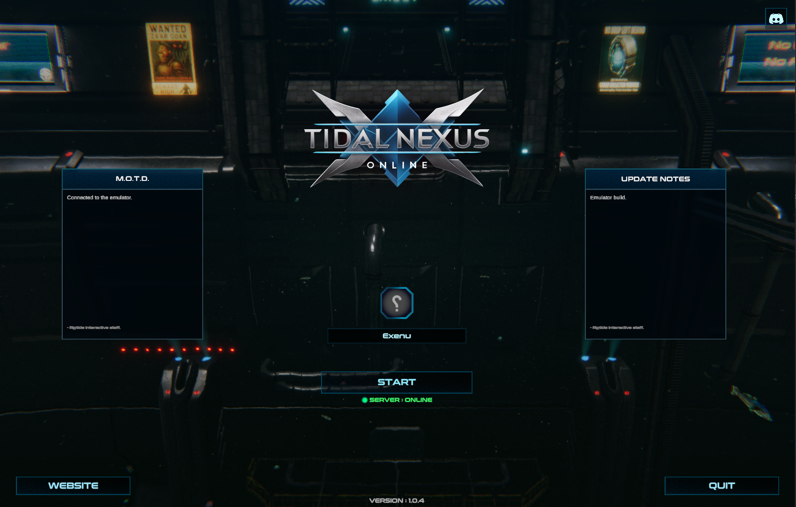
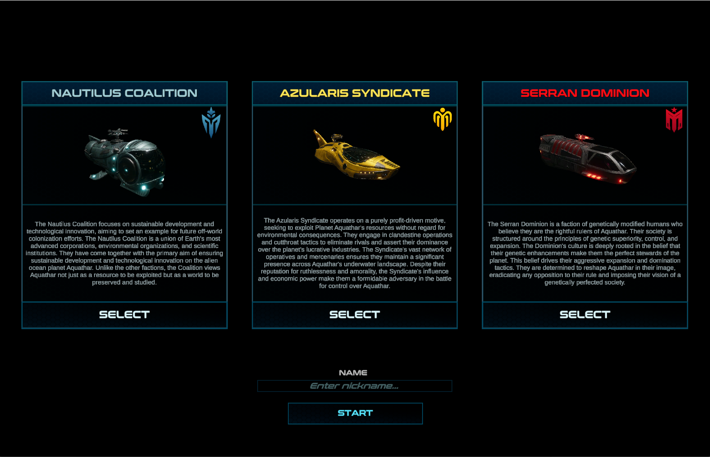
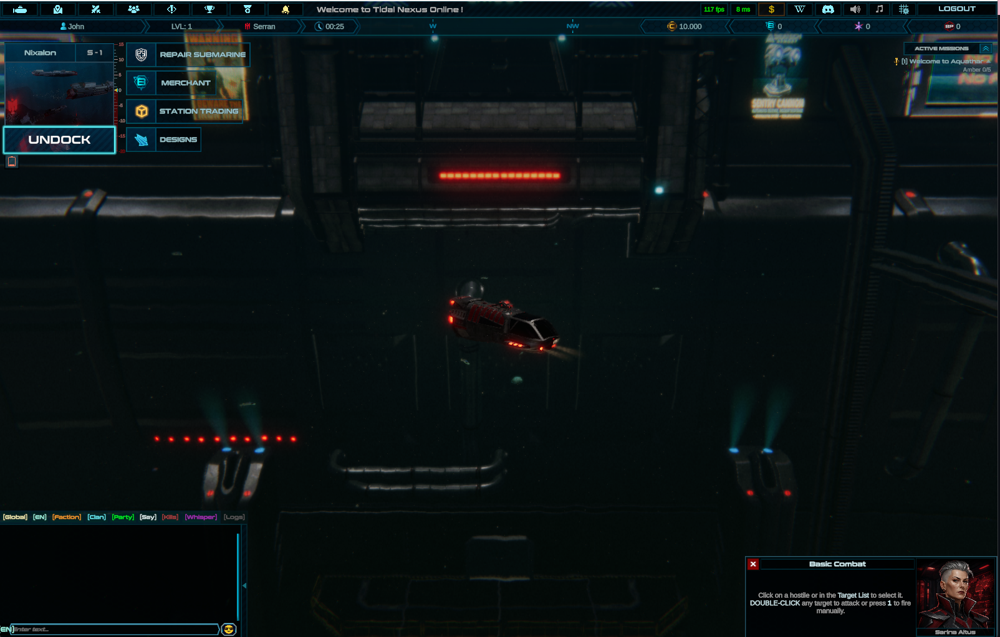
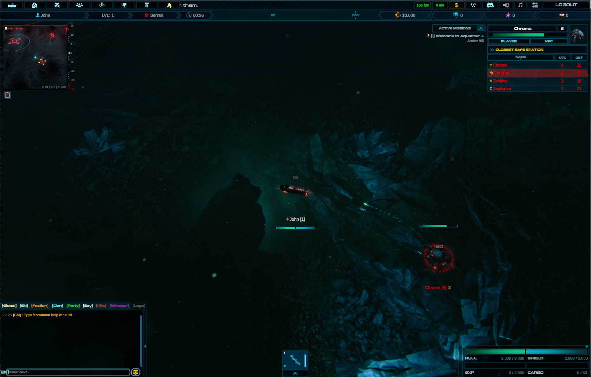
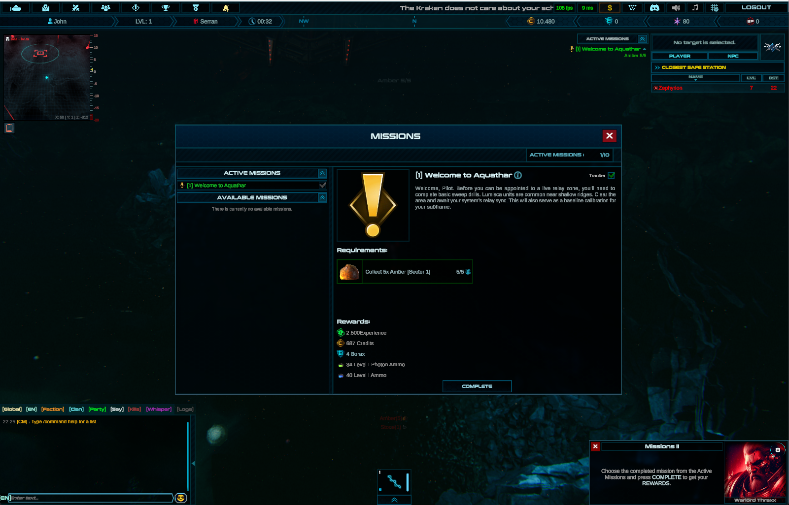

# Tidal Nexus Emulator

This is an emulator built for [Tidal Nexus Online](https://tidalnexusonline.com/).

This project is for _educational use_ and only provides the network code - you will need the Unity Client to run it.

_The shipped Steam client, version 1.0.4, connected to the emulator._

## How did you emulate this?

This was made possible by using the following tools:

- [Asset Ripper](https://github.com/assetripper/assetripper)
- [Photon](https://www.photonengine.com/)
- [Claude](https://claude.ai)

I first started by using Asset Ripper to extract the game's scripts and assets. Once extracted, I used Claude Fable to analyze the extracted contents and construct a Unity Project.
After many hours of Claude doing its work, it presented me with a working Unity project I could compile and build Tidal Nexus Online from.

Unfortunately, when Unity builds the game the shaders are compiled into the binary, which makes them difficult to extract and would require re-writing the 300+ shaders.
As I was only emulating, and the server is headless, I didn't need to worry about those shaders.

The reason we need this game back as a Unity Project is because the game uses Photon for its networking.

From my understanding, Photon is similar to peer-to-peer networking: one client is authoritative while the others are obeying. The client released on Steam is the obeying client, while the authoritative client runs on their own machines.

As I used AssetRipper and Claude to convert this back into a Unity Project, I was missing the authoritative code.

Since we have the obeying client back as a Unity Project, we can examine the [RPC](https://doc.photonengine.com/fusion/v2/manual/data-transfer/rpcs) calls - this tells us how the client communicates with the server.

However, while the client does include the server RPC calls, they are no-ops: Fusion's WeaverStrip removes the bodies at build time, because a client can never be the source of a server-authoritative RPC, so the body is dead weight in the shipped build. The signatures survive, and those alone gave us enough of a clue to start re-adding the server logic.

Writing an emulator from pure trial-and-error is tough and time consuming; it would take months to reach a playable state - and my personal time is becoming more limited as the days go by. On top of that, I'm inexperienced with Photon: how does it actually work? That was one thing I needed to understand fully before taking on this task.

A new dawn is upon us, giving us developers new _godly skills_ - and that is **Claude**.

I created and wrote a markdown file outlining the specification of what I needed Claude to do:

- Providing the [Tidal Nexus Online Wiki](https://tidalnexusonline.wiki.gg/)
- Providing the [Photon Documentation](https://doc-api.photonengine.com/)
- Writing about what Tidal Nexus is and what game engine it uses (Unity)
- Where and how to look for the RPC commands
- Supplying the Unity Project we re-created

With those items, I asked Claude to start multiple agents, each one tasked with architecting and implementing:

- Authentication
   - Server List
   - Steam Authentication
- NPC AI
- Combat Behaviour
- NPC & Ore Spawn Pools
- Chat
    - Commands
- Clans
- Merchant
- Trade Station
- Events
- Missions
- Repairing
- and a lot more!

Once Claude had developed and compiled the server without errors, the first attempt failed: it couldn't get past the authentication screen.
This is where Claude is extremely powerful - with its multiple agents, it ran an agentic loop of record > diagnose > fix.

After a few hours of letting the agents diagnose the problems and implement the solutions, I was able to get past the authentication screen and into the in-game screen.

_Character creation - the three factions and their starting submarines._

From there, Claude was on fire, developing every feature the sun laid upon. I did steer it sometimes in terms of code layout and design patterns.

_Docked at Nixalon S-1, with repairing, the merchant, station trading and designs all served by the emulator._

_Combat against an NPC, with the target list, mission tracker and chat all live._

_Mission window showing a Mission completed_

What this has taught me is that LLMs have completely changed the game. What would have taken me 6+ months was achieved in under _2 days_.
